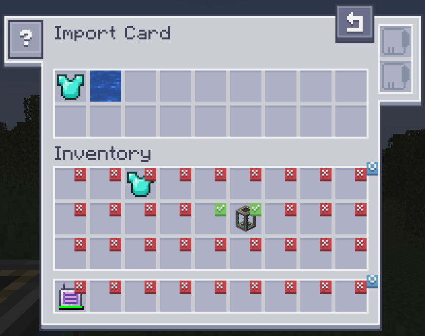
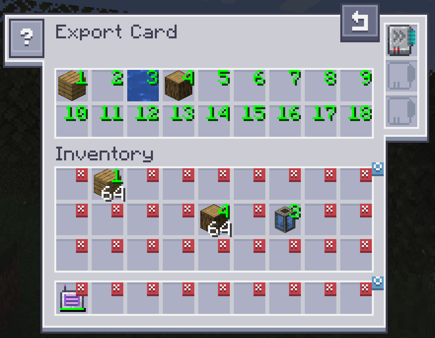
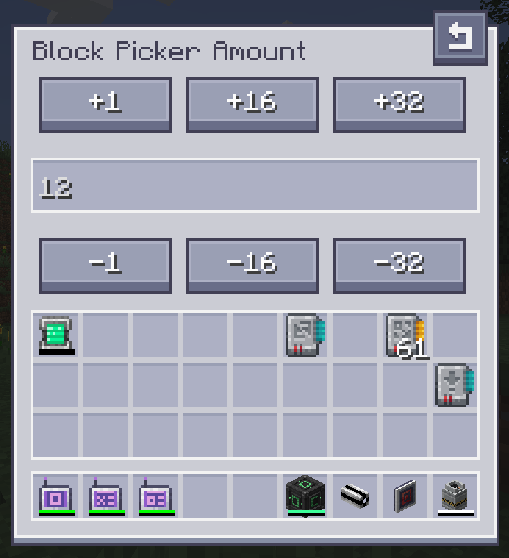

---
navigation:
  title: "附屬模組：AE2 輸入輸出卡"
  icon: ae2importexportcard:export_card
  position: 150
categories:
  - tools
item_ids:
- ae2importexportcard:export_card
- ae2importexportcard:import_card
- ae2importexportcard:block_picker_card
---

# AE2 輸入輸出卡

<Row>
  <ItemImage id="ae2importexportcard:export_card" scale="2" />

  <ItemImage id="ae2importexportcard:import_card" scale="2" />

  <ItemImage id="ae2importexportcard:block_picker_card" scale="2" />
</Row>

輸入卡、輸出卡與方塊提取卡允許你將物品自物品欄輸入至網路或由網路輸出。

## 輸入卡

<ItemImage id="ae2importexportcard:import_card" scale="2" />

輸入卡會提取你物品欄中特定槽位的物品，並將其送入你的 ME 系統中。

點擊槽位會標記勾選記號。任何位於帶有勾選記號槽位中的物品，都會被輸入至你的 ME 系統。將物品從你的物品欄拖曳至頂部即可更改過濾條件。

### 升級

輸入卡支援以下[升級](items-blocks-machines/upgrade_cards.md)：

*   <ItemLink id="fuzzy_card" /> 依損耗程度過濾及/或忽略物品 NBT
*   <ItemLink id="inverter_card" /> 將過濾模式由白名單切換為黑名單

### 合成配方

<RecipeFor id="ae2importexportcard:import_card" />

## 輸出卡

<ItemImage id="ae2importexportcard:export_card" scale="2" />

輸出卡的操作方式與輸入卡完全相同，但它是將物品從你的 ME 系統提取至你的物品欄中。

若要指定物品，請將物品從物品欄拖曳至頂部的任一槽位，並點擊物品欄中的槽位以變更為所需的數量。點擊右鍵可清除並重設回 X。

### 升級

輸出卡支援以下[升級](items-blocks-machines/upgrade_cards.md)：

*   <ItemLink id="fuzzy_card" /> 依損耗程度過濾 以及/或 忽略物品 NBT
*   <ItemLink id="speed_card" /> 將傳輸速度從 1 個提升至整組物品
*   <ItemLink id="crafting_card" /> 當物品庫存不足時自動發起請求並合成

### 合成配方

<RecipeFor id="ae2importexportcard:export_card" />

## 方塊提取卡

<ItemImage id="ae2importexportcard:block_picker_card" scale="2" />

方塊提取卡讓你能直接從網路中提取你當前注視的方塊。只需瞄準方塊並按下「選擇方塊」按鍵即可。若網路中有相符的方塊，便會自動提取至你的物品欄中。

### 合成配方

<RecipeFor id="ae2importexportcard:block_picker_card" />
